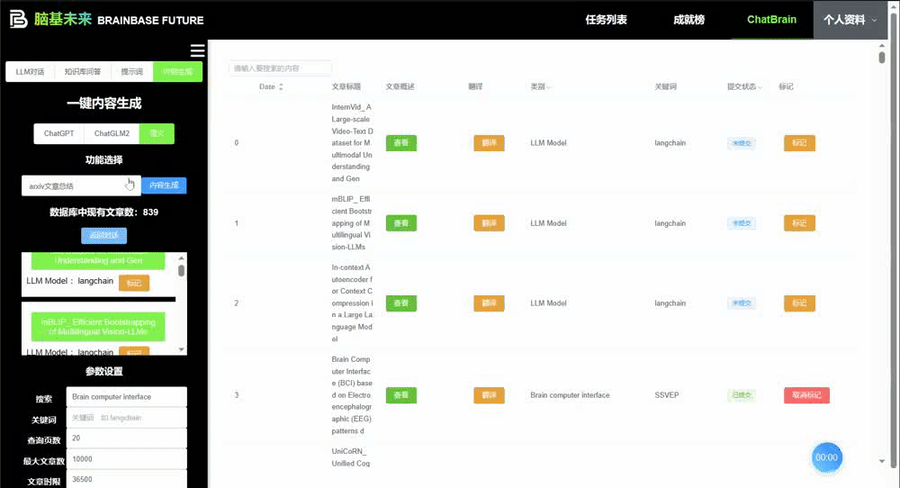
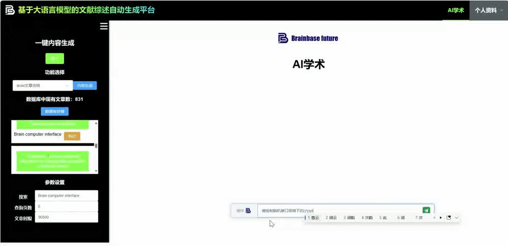
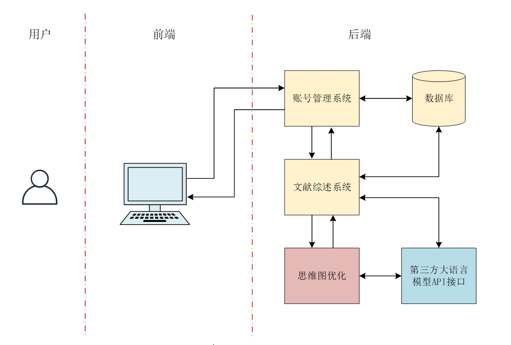

# ChatBrain AI 学术助手 V2.0 

<div style="font-size: 1.5rem;">
  <a href="./README.md">中文</a> |
  <a href="./readme_en.md">English</a>
</div>
</br>

本项目已获

* 科大讯飞“星火杯”认知大模型场景创新赛 全国三等奖（Top 8）
* 2023华为开发者大赛 全国三等奖

并且作为 BrainBase Future——引领脑机接口教育时代 应用矩阵的产品之一 

获得 第九届中国国际“互联网+”大学生创新创业大赛北京赛区一等奖。

**功能概览**

V 2.0 版本功能模块包括论文数据库Plus、AI数据统计、AI综述生成。

* 论文数据库Plus利用AI检索得到的所有论文资料并且对每篇论文进行总结、翻译并保存在数据库中。



* AI数据统计对关键词出现的次数进行统计并生成词云图和频率直方图。并且绘制出关键词首次出现的时间及随时间累积的频率。


* AI综述生成板块基于讯飞星火大模型，通过AI Agent工具调用，对某领域一键生成综述。



## 系统架构图



本系统分为六大功能板块:
* 前端页面
* 账号管理系统
* 文献综述系统
* 思维图优化算法系统
* 数据库系统
* LLM 接口管理

各模块对应文件夹目录为：
* 前端页面：./BrainBaseFuture_Team/vue
* 账号管理系统：./BrainBaseFuture_Team
* 文献综述系统：./chat_server
* 思维图优化算法系统：相关研究成果未发表，暂不公布
* 数据库系统： 使用Mysql数据库
* LLM 接口管理： ./chat_server

## 安装

前端页面采用 VUE3 构建；账号管理系统采用 Go 语言搭建；文献综述系统使用 Python。

### 前端页面
请自行安装 nodejs v16.17.0 +

使用如下命令启动服务

```
cd ./BrainBaseFuture_Team/vue
npm run dev
```

### 账号管理系统
请自行安装 go1.21.0 +

使用如下命令启动服务

```
cd ./BrainBaseFuture_Team
go run main.go route.go
```

### 文献综述系统
请自行配置 Python 3.8 + 环境

使用如下命令安装 Python 包

```
cd ./chat_server
pip install -r requirements.txt
```

修改服务器 IP 地址为实际部署的 IP
```
SERVER_ADDRESS = ''  # 替换为你的IP地址
```

使用如下命令启动服务

```
cd ./chat_server
python main.py
```

### 思维图优化算法系统

暂不公布

### 数据库系统
使用 MySQL 数据库。

可使用 ./chat_server/bbft.sql 加载数据库。

* 注：翻译后的 Markdown 文档和原始 PDF 文献存储在本地绝对路径。本代码包暂不提供。

### LLM 接口管理

基于星火模型需要在以下两个文件中相应位置配置 API Key

* ./chat_server/SparkApi_none_stream.py
* ./chat_server/SparkWS.py

### 环境配置教程
更详细的环境配置教程可参见 https://github.com/JayceNing/ChatBrain/blob/master/docs/environment_setup.md

## 快速使用

本应用已部署至公网

访问 http://121.43.42.18:5173/

测试账号：nxyqdl@163.com

密码：123456

## 贡献者

<a href="https://github.com/JayceNing/ChatBrain/graphs/contributors">
  
</a>

Jayce Ning

个人主页：https://jaycening.github.io/zh-cn/

Github：https://github.com/JayceNing

知乎：https://www.zhihu.com/people/XinyuNing

## 项目引用

如果你觉得这个仓库很有价值，请给它打个星!

如果您使用此项目中的数据或代码，请引用此项目。

```
@misc{ChatBrain,
  author={Xinyu Ning, Guanglong Zhang, Yutong Zhao, Di Zhou},
  title = {ChatBrain: A Literature Review Automatic Generation Platform Based on LLM.},
  year = {2023},
  publisher = {GitHub},
  journal = {GitHub repository},
  howpublished = {\url{https://github.com/JayceNing/ChatBrain}},
}
```

## 致谢

* 本项目的论文总结部分代码主要建立在 [ChatPaper](https://github.com/kaixindelele/ChatPaper) 的基础上，感谢开源！